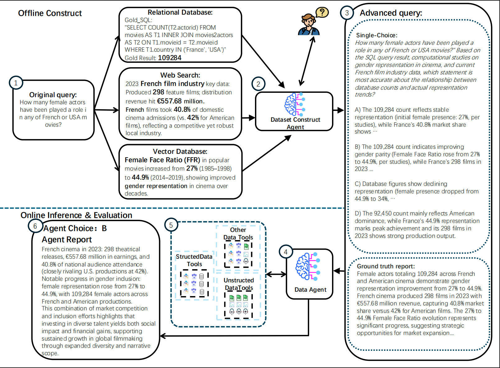

# FDABench
[](https://www.python.org/downloads/)
[](https://opensource.org/licenses/MIT)
[](https://arxiv.org/pdf/2509.02473)

## 📰 News

- 🎉 We are pleased to announce the official release of FDABench on HuggingFace! FDABench now seamlessly loads data directly from both [FDAbench2026/Fdabench-Full](https://huggingface.co/datasets/FDAbench2026/FDAbench-Full) and [FDAbench2026/Fdabench-Lite](https://huggingface.co/datasets/FDAbench2026/Fdabench-Lite). The FDABench-Full dataset contains 2,007 comprehensive test cases, while FDABench-Lite provides 289 pure SQLite test cases for faster experimentation. Both datasets span three distinct task categories: report, single-choice, and multiple-choice. We specifically designed FDABench-Lite with pure SQLite compatibility to enable users to get started quickly with minimal setup requirements.

**FDABench** is the first data agent benchmark specifically designed for evaluating agents in multi-source data analytical scenarios. Our contributions include: (i) we construct a standard benchmark with 2,007 diverse tasks across different data sources, domains, difficulty levels, and task types to comprehensively evaluate data agent performance; (ii) we design an agent-expert collaboration dataset generation framework ensuring reliable and efficient heterogeneous data benchmark construction; (iii) we equip FDABench with strong generalization capabilities across diverse target systems and frameworks. We use FDABench to evaluate various data agent systems, revealing that each data agent system exhibits distinct advantages and limitations regarding response quality, accuracy, latency, and token cost.

## Overview



*FDABench provides a comprehensive framework for evaluating data agents across multiple dimensions including accuracy, latency, cost, and tool usage efficiency. The benchmark supports diverse agent architectures and integrates with various database systems and semantic operators.*

## Key Features

- **Open-Source Data Agents Implementations**: Provides several ready-to-use data agent workflow implementations 
- **Agents Evaluation Framework**: Comprehensive support for evaluating diverse data agent architectures including Tool-Use Agents, Multi-Agent Systems, Planning Agents, and Reflection Agents
- **Universal Database Compatibility**: Seamlessly integrates with multiple database systems and real-world production environments
- **Flexible Data Agent Task Architecture**: Supports three distinct workload types - single-choice questions, multiple-choice scenarios, and open-ended report generation tasks
- **Advanced Evaluation Metrics**: Built-in comprehensive evaluation system with detailed performance analytics and statistical insights about data agent systems
- **Rich Agent Tool Ecosystem**: Extensive collection of integrated tools including database schema analysis, SQL query optimization, web search capabilities, and vector database operations
- **Extensible Agent Framework**: Modular base classes and interfaces that enable easy implementation and integration of custom agent architectures
- **Cost Monitoring**: Token usage tracking and cost analysis for data agent performance optimization and budget management

## Benchmark Workload

### Task Categories
- **Single Choice**: Multiple choice questions with one correct answer
- **Multiple Choice**: Questions allowing multiple correct answers
- **Report Mode**: Open-ended analytical tasks requiring comprehensive database analysis

### Data Agent Interface
The benchmark uses a standardized agent interface that abstracts away implementation details, allowing fair comparison across different agent architectures and approaches.

## Environment Setup

### System Requirements

- **Python:** 3.10+
- **OS:** Linux, macOS, Windows

### Option 1: One-Command Setup

Create the complete environment with all dependencies:

```bash
conda env create -f environment.yml
conda activate fdabench
```

This will:
- Create a new conda environment named `fdabench`
- Install Python 3.11 and all required dependencies
- Automatically install FDABench in development mode

### Option 2: Manual Setup

If you prefer manual installation:

```bash
# Create environment
conda create -n fdabench python=3.11
conda activate fdabench

# Install FDABench
pip install -e .
```

### API Configuration

Set up your API keys for LLM access:

```bash
# Option 1: Environment variables
export OPENROUTER_API_KEY="your-openrouter-api-key"

# Option 2: Create .env file in project root
echo "OPENROUTER_API_KEY=your-openrouter-api-key" >> .env
```

## Quick Start 

After completing the environment setup above, you can immediately start using FDABench with FDABench-Lite:

### Database Download
To download the FDABench-Lite related database files, please access the database file at this [link](https://drive.google.com/file/d/1Ae2XQ-3VvhDvqfCBbIbeyQeYim58GFp7/view?usp=sharing). After downloading, please extract the database files to your desired directory.

### Configure Database Paths

Edit `FDABench/utils/database_connection_manager.py` and update the configuration:

```python
default_config = {
    # SQLite database paths
    'bird_db_path': "/your/path/to/databases",
    'local_db_path': "/your/path/to/databases", 
    'spider1_db_path': "/your/path/to/databases",
    
}
```

### Dataset Loading and Start

**HuggingFace Dataset**: FDABench now loads data directly from the HuggingFace dataset hub. The dataset `FDAbench2026/Fdabench-Lite` contains 289 curated test cases in three tasks for immediate use. We also offer FDABench-Full with 2007 test cases on HuggingFace.

```bash
# Activate your environment (if not already active)
conda activate fdabench

# Run your first example - automatically loads from HuggingFace
python examples/run_planning_agent.py

# Run with a specific sample (0-116 available)
python examples/run_planning_agent.py --index 10

# Run with a custom model
python examples/run_planning_agent.py --model "openai/gpt-5" --index 5
```

## FDABench-Full Usage

### Database Configuration

FDABench-Full supports multiple database types including Snowflake, Bigquery and SQLlite. You need to configure database paths and obtain required data:

#### 1. SQLite Databases

**BIRD Dataset**: Download from [BIRD repository](https://github.com/AlibabaResearch/DAMO-ConvAI/tree/main/bird)

**Spider2-lite Dataset**: Download from [Spider2 spider-agent-lite](https://github.com/xlang-ai/Spider2/tree/main/methods/spider-agent-lite)

#### 2. Cloud Databases  

**BigQuery and Snowflake**: Follow registration and setup instructions from [Spider2 README](https://github.com/xlang-ai/Spider2/blob/main/README.md)

#### 3. Unstructured Data

**Unstructured Dataset**: Download from [Google Drive](https://drive.google.com/file/d/1so5dvpB2aroy4NMaxh4FmnmGhGhPGvIs/view?usp=sharing)

#### 4. Configure Database Paths

Edit `FDABench/utils/database_connection_manager.py` and update the configuration:

```python
default_config = {
    # SQLite database paths
    'bird_db_path': "/your/path/to/BIRD_train/train_databases",
    'local_db_path': "/your/path/to/local/databases", 
    'spider1_db_path': "/your/path/to/spider1/databases",
    
    # Cloud database credentials
    'bigquery_credentials_path': "/your/path/to/bigquery-service-account.json",
    'snowflake_config': {
        'account': 'your-snowflake-account',
        'user': 'your-username', 
        'password': 'your-password',
        'warehouse': 'your-warehouse',
        'database': 'your-database'
    }
}
```

#### 4. Directory Structure
```
your_databases/
├── BIRD_train/train_databases/
│   ├── california_schools/
│   │   └── california_schools.sqlite  
│   ├── card_games/
│   │   └── card_games.sqlite
│   └── ...
├── spider1_databases/
│   ├── concert_singer.sqlite
│   ├── pets_1.sqlite  
│   └── ...
├── local_databases/
│   └── merchant_data.db
└── credentials/
    └── bigquery-service-account.json
```

#### 5. Dataset Configuration

**HuggingFace Dataset (Default)**: The benchmark uses the `FDAbench2026/Fdabench-Lite` dataset from HuggingFace, which includes:
- 289 curated test cases
- Three subsets (report, single, multiple )
- Multiple database types (BIRD, local, Spider2-lite)
- Various difficulty levels (easy, medium, hard)

**Loading Data in Your Code**:

```python
from FDABench.utils.test_utils import load_test_data

# Load the first sample (default)
test_data = load_test_data()

# Load a specific sample by index (0-116)
test_data = load_test_data(index=10)
```

**Custom Local Datasets**: If you have your own test data, you can still use local JSON files by modifying the `load_test_data()` function in `FDABench/utils/test_utils.py`.

### Examples

Test different agent workflows with HuggingFace dataset:

```bash
# Planning Agent - Uses step-by-step planning
python examples/run_planning_agent.py                # Default: index 0
python examples/run_planning_agent.py --index 25     # Specific sample

# Multi-Agent - Coordinates multiple specialized agents
python examples/run_multi_agent.py --index 10

# Reflection Agent - Self-improving with reflection
python examples/run_reflection_agent.py --index 50

# Tool-Use Agent - Optimized for tool selection
python examples/run_tooluse_agent.py --index 100

# All agents support the same parameters:
# --index N: Select sample N from the dataset (0-116)
# --model "model_name": Specify the LLM model to use
```

#### Data Agent with Semantic Operator

Data agents integrated with semantic data operators for advanced data processing:

```bash
# DocETL Semantic Operator Agent - Uses DocETL operators for document processing
python FDABench/examples/test_planning_agent_docetl_batch.py

# Lotus Semantic Operator Agent - Uses Lotus operators for natural language processing
python FDABench/examples/test_planning_agent_lotus_batch.py

# Palimpzest Semantic Operator Agent - Uses Palimpzest operators for data transformation
python FDABench/examples/test_planning_agent_pz_batch.py
```

**Note**: Data Agent with semantic operator require additional environment setup. Check the respective environment files:
- `FDABench/examples/docetl_environment.yml`
- `FDABench/examples/lotus_environment.yml` 
- `FDABench/examples/palimpzest_environment.yml`

### Basic Usage Example

```python
from FDABench.agents.planning_agent import PlanningAgent
from FDABench.evaluation.evaluation_tools import ReportEvaluator
from FDABench.utils.test_utils import load_test_data

# Initialize agent with your preferred model
agent = PlanningAgent(
    model="openai/gpt-5",  # or "deepseek/deepseek-chat-v3"
    api_key="your-api-key"
)

# Load test data from HuggingFace dataset
test_data = load_test_data(index=0)  # Load first sample
print(f"Processing task: {test_data['task_id']}")
print(f"Database: {test_data['db']}")
print(f"Question type: {test_data['question_type']}")

# Process the query
result = agent.process_query_from_json(test_data)
print(f"Generated report: {result['report'][:200]}...")

# Load and process multiple samples
for i in range(5):
    test_data = load_test_data(index=i)
    result = agent.process_query_from_json(test_data)
    print(f"Task {i}: {test_data['task_id']} - Completed")
```

### Output and Results

All test results are automatically saved to:
- `results/` - DuckDB files with test results and metrics
- `FDABench/examples/data/` - Temporary processing files

## Agent-Expert Dataset Generation

### Start To Build Test Cases

To generate new test cases using the agent-expert collaboration framework:

```bash
cd dataset_build/

# Interactive mode (default) - with human expert review
python main.py

# Automatic mode - without human review  
python main.py --auto

# Set maximum revisions per item
python main.py --max-revisions 5
```

### Code Structure

```
dataset_build/
├── main.py              # Main dataset builder with human feedback support
├── external_tools.py    # Smart tool selection (web/vector/file system)
├── input_data/          # Source data and configurations
│   ├── original_data/   # Original SQL queries (bird.jsonl)
│   ├── gold_sql_result/ # Expected SQL execution results
│   └── gold_sql_query/  # Gold SQL
└── output_data/         # Generated test cases
```

The framework implements three-phase generation: (1) data initialization , (2) expert verification with accept/dispose/revise options, and (3) finalization.


## Other Data Agent Integration

### Adding a New Agent

To integrate a new DB agent, inherit from the `BaseAgent` class:

```python
from FDABench.core.base_agent import BaseAgent

class YourCustomAgent(BaseAgent):
    def __init__(self, model="openai/gpt-5", api_key=None, **kwargs):
        super().__init__(model=model, api_key=api_key, **kwargs)
        # Initialize your agent-specific components
    
    def process_query_from_json(self, query_data):
        """Main method to process queries from JSON format"""
        question_type = query_data.get("question_type", "report")
        
        if question_type == "single_choice":
            return self.process_single_choice(query_data)
        elif question_type == "multiple_choice":
            return self.process_multiple_choice(query_data)
        elif question_type == "report":
            return self.process_report(query_data)
    
    def process_single_choice(self, query_data):
        # Implement single choice question handling
        # Return {"selected_answer": "A", "metrics": {...}}
        pass
    
    def process_multiple_choice(self, query_data):
        # Implement multiple choice question handling  
        # Return {"selected_answers": ["A", "C"], "metrics": {...}}
        pass
    
    def process_report(self, query_data):
        # Implement report generation
        # Return {"report": "Generated report...", "metrics": {...}}
        pass
```

### Supported Integrations

- **OpenAI**: GPT-5, and other OpenAI models
- **LangChain**: Full LangChain ecosystem support
- **Private APIs**: Custom API integrations
- **Local Models**: Support for locally hosted LLMs

## Dataset Format

### Input Schema

The benchmark uses a structured JSON format for test cases:

```json
{
    "task_id": "FDA123",
    "instance_id": "bq001",
    "db": "ga360",
    "level": "hard",
    "database_type": "Spider2-lite",
    "question_type": "single_choice",
    "tools_available": ["get_schema_info", "generated_sql", "execute_sql"],
    "query": "Your database question here",
    "options": {
        "A": "Option A text",
        "B": "Option B text", 
        "C": "Option C text",
        "D": "Option D text"
    },
    "correct_answer": ["C"],
    "explanation": "Detailed explanation of the correct answer"
}
```

## Evaluation Metrics

### Core Metrics

- **Accuracy**: Percentage of correctly answered questions
- **Execution Success**: Rate of successful SQL query execution
- **Latency**: Average ent-to-end response time per query
- **Tool Usage Score**: Effectiveness of tool selection and usage


## Directory Structure

```
FDABench/
├── FDABench/                     # Main package
│   ├── agents/                   # Pre-implemented agent types
│   │   ├── multi_agent.py       # Multi-agent coordination system
│   │   ├── planning_agent.py    # Step-by-step planning agent
│   │   ├── reflection_agent.py  # Self-reflective agent
│   │   └── tool_use_agent.py    # Tool-focused agent
│   ├── core/                    # Core framework components
│   │   ├── base_agent.py       # Base agent interface
│   │   ├── token_tracker.py    # Token usage monitoring
│   │   └── tool_registry.py    # Tool management system
│   ├── evaluation/              # Evaluation and scoring tools
│   │   └── evaluation_tools.py # Comprehensive evaluation suite
│   ├── tools/                   # Database and utility tools
│   │   ├── schema_tools.py     # Database schema analysis
│   │   ├── sql_tools.py        # SQL generation and optimization
│   │   └── search_tools.py     # Web and vector search tools
│   ├── utils/                   # Utility functions
│   │   └── database_connection_manager.py  # Database connectivity
│   └── prompts/                 # Prompt templates and management
│       └── prompts.py          # Standard prompts for agents
├── examples/                    # Usage examples and test scripts
│   ├── data/                   # Temporary processing files
│   ├── run_planning_agent.py   # Planning agent examples
│   ├── run_multi_agent.py      # Multi-agent examples
│   ├── run_reflection_agent.py # Reflection agent examples
│   └── run_tooluse_agent.py    # Tool-use agent examples
├── FDABench/examples/           # Semantic operator agents  
│   ├── test_planning_agent_docetl_batch.py   # DocETL semantic operators
│   ├── test_planning_agent_lotus_batch.py    # Lotus semantic operators
│   ├── test_planning_agent_pz_batch.py       # Palimpzest semantic operators
│   ├── docetl_environment.yml  # DocETL environment setup
│   ├── lotus_environment.yml   # Lotus environment setup
│   └── palimpzest_environment.yml # Palimpzest environment setup
├── sample/                      # Legacy sample data (deprecated)
│   ├── sample_data.json        # Sample task configuration
│   └── regional_sales/         # Sample database directory
│       └── regional_sales.sqlite # Sample SQLite database
├── results/                     # Test results and output files
├── environment.yml             # Conda environment specification
├── pyproject.toml              # Package configuration
├── INSTALL.md                  # Detailed installation guide
└── README.md                   # This file
```

## Contributing

We welcome contributions to FDABench! Here's how you can help:

### Adding New Benchmark Tasks

1. **Create task definitions** following the existing JSON schema
2. **Include gold standard answers** with detailed explanations
3. **Test with multiple agent types** to ensure fairness
4. **Document complexity levels** and expected difficulty

### Contributing New Agent Wrappers

1. **Inherit from BaseAgent** or CustomAgentBase
2. **Implement all required methods** (single_choice, multiple_choice, report)
3. **Add comprehensive error handling** and logging
4. **Include usage examples** and documentation
5. **Test with the evaluation suite** to ensure compatibility

### Development Guidelines

- Follow PEP 8 style guidelines
- Add type hints for all public methods
- Include docstrings with parameter descriptions
- Write unit tests for new functionality
- Update documentation for API changes

### Pull Request Process

1. Fork the repository
2. Create a feature branch (`git checkout -b feature/amazing-feature`)
3. Commit your changes (`git commit -m 'Add amazing feature'`)
4. Push to the branch (`git push origin feature/amazing-feature`)
5. Open a Pull Request with detailed description

## Submission

If you need to submit results, please submit them in JSONL format similar to `results/submission.jsonl` to **FDAbench2026@gmail.com**.

Each line should contain a JSON object with the following key fields:
- `task_id`, `instance_id`, `db`, `level`, `database_type`, `question_type`
- For report tasks: `"generated_report": "your report content"`
- For single choice: `"selected_answer": ["A"]`
- For multiple choice: `"selected_answer": ["A", "C", "F"]`
- Performance metrics: `tool_executed`, `latency`, `total_tokens`, `total_cost`, etc.

Example format:
```json
{"task_id": "FDA0045", "question_type": "report", "generated_report": "...", "tool_executed": ["tool_1"], "latency": "", "total_tokens": ""}
{"task_id": "FDA0803", "question_type": "single_choice", "selected_answer": ["D"], "tool_executed": ["tool_1"], "latency": "", "total_tokens": ""}
```

## Citation

If you find FDABench useful in your research, please consider citing our paper:
```
@article{wang2025fdabench,
  title={FDABench: A Benchmark for Data Agents on Analytical Queries over Heterogeneous Data},
  author={Wang, Ziting and Zhang, Shize and Yuan, Haitao and Zhu, Jinwei and Li, Shifu and Dong, Wei and Cong, Gao},
  journal={arXiv preprint arXiv:2509.02473},
  year={2025}
}

```


---
