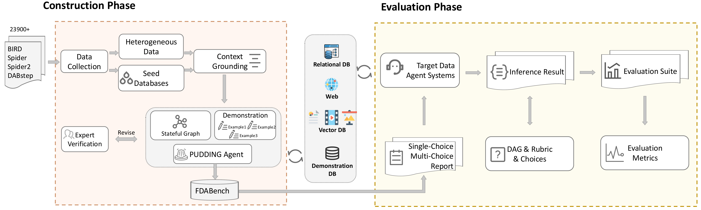
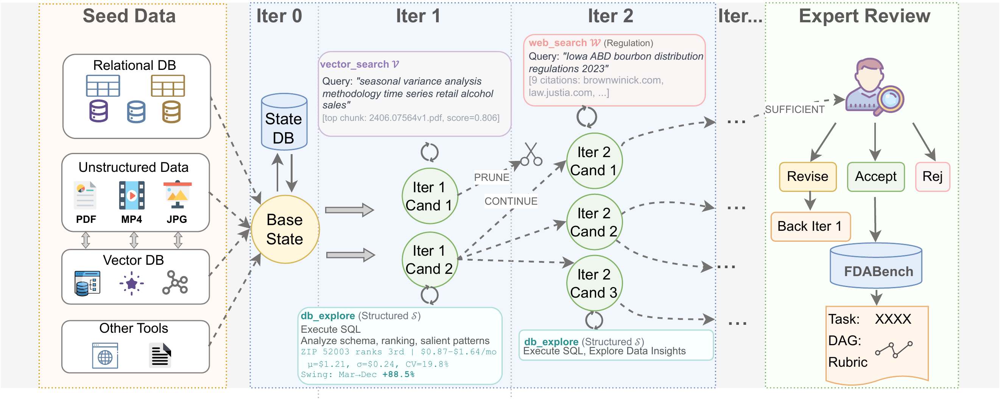

# FDABench

[](https://www.python.org/downloads/) [](https://opensource.org/licenses/MIT) [](https://arxiv.org/pdf/2509.02473) [](https://fdabench.github.io/) [](https://huggingface.co/datasets/FDAbench2026/FDAbench-Full) [](https://huggingface.co/datasets/FDAbench2026/Fdabench-Lite) [](https://huggingface.co/datasets/FDAbench2026/FDABench-File)

(KDD'26) **FDABench** is a benchmark for evaluating data agents on analytical queries over heterogeneous data. It contains 2,007 tasks across diverse domains, difficulty levels, and task types. We provide ready-to-use data agent implementations, a DAG-based evaluation system, and an agent-expert collaboration framework for dataset generation.

## Overview

<p align="center">

</p>

<p align="center">

</p>

## Key Features

- **Data Agent Implementations**: Ready-to-use agents (Planning, Multi-Agent, Reflection, Tool-Use)
- **Comprehensive Evaluation**: Accuracy metrics, rubric-based scoring, and performance analytics
- **Multi-Database Support**: SQLite, BigQuery, Snowflake, and unstructured data sources
- **Three Task Types**: Single-choice, multiple-choice, and open-ended report generation
- **Extensible Framework**: Modular base classes for custom agent integration
- **Cost Tracking**: Token usage and latency monitoring

## Task Types

| Type | Description |
|------|-------------|
| Single Choice | One correct answer from four options |
| Multiple Choice | Multiple correct answers allowed |
| Report | Open-ended analytical report generation |

## Environment Setup

### System Requirements

- **Python:** 3.10+
- **OS:** Linux, macOS, Windows

### Option 1: One-Command Setup

Create the complete environment with all dependencies:

```bash
conda env create -f environment.yml
conda activate fdabench
```

This will:
- Create a new conda environment named `fdabench`
- Install Python 3.11 and all required dependencies
- Automatically install FDABench in development mode

### Option 2: Manual Setup

If you prefer manual installation:

```bash
# Create environment
conda create -n fdabench python=3.11
conda activate fdabench

# Install FDABench
pip install -e .
```

### API Configuration

Set up your API keys for LLM access:

```bash
# Option 1: Environment variables
export OPENROUTER_API_KEY="your-openrouter-api-key"

# Option 2: Create .env file in project root
echo "OPENROUTER_API_KEY=your-openrouter-api-key" >> .env
```

## Quick Start

After completing the environment setup above, you can immediately start using FDABench with FDABench-Lite:

### Dataset Loading and Start

**HuggingFace Dataset**: FDABench now loads data directly from the HuggingFace dataset hub. The dataset `FDAbench2026/Fdabench-Lite` contains 289 curated test cases in three tasks for immediate use. We also offer FDABench-Full with 2,007 test cases on HuggingFace, and the raw multimodal corpus (PDFs, images, audio, video across 50 domains) at `FDAbench2026/FDABench-File`.

```bash
# Activate your environment (if not already active)
conda activate fdabench

# Run your first example - automatically loads from HuggingFace
python examples/run_planning_agent.py

# Run with a specific sample
python examples/run_planning_agent.py --index 10

# Run with a custom model
python examples/run_planning_agent.py --model "openai/gpt-5" --index 5
```

## FDABench-Full Usage

### Database Configuration

FDABench-Full supports multiple database types including Snowflake, Bigquery and SQLlite. You need to configure database paths and obtain required data:

#### 1. SQLite Databases

**BIRD Dataset**: Download from [BIRD repository](https://github.com/AlibabaResearch/DAMO-ConvAI/tree/main/bird)

**Spider2-lite Dataset**: Download from [Spider2 spider-agent-lite](https://github.com/xlang-ai/Spider2/tree/main/methods/spider-agent-lite)

#### 2. Cloud Databases

**BigQuery and Snowflake**: Follow registration and setup instructions from [Spider2 README](https://github.com/xlang-ai/Spider2/blob/main/README.md)

#### 3. Unstructured Data

**Raw multimodal corpus**: Download from [`FDAbench2026/FDABench-File`](https://huggingface.co/datasets/FDAbench2026/FDABench-File) (1,418 PDFs, 246 images, 108 audio, 81 video across 50 domain categories).

```bash
huggingface-cli download FDAbench2026/FDABench-File --repo-type=dataset --local-dir ./Vector_Database
```

For the FAISS index over this corpus, build your own with `FDABench.utils.vector_index_builder` (recommended) so chunk size and embedding model match your evaluation setup.

#### 4. Configure Database Paths

Edit `FDABench/utils/database_connection_manager.py` and update the configuration:

```python
default_config = {
    # SQLite database paths
    'bird_db_path': "/your/path/to/BIRD_train/train_databases",
    'local_db_path': "/your/path/to/local/databases",
    'spider1_db_path': "/your/path/to/spider1/databases",

    # Cloud database credentials
    'bigquery_credentials_path': "/your/path/to/bigquery-service-account.json",
    'snowflake_config': {
        'account': 'your-snowflake-account',
        'user': 'your-username',
        'password': 'your-password',
        'warehouse': 'your-warehouse',
        'database': 'your-database'
    }
}
```

#### 5. Directory Structure
```
your_databases/
├── BIRD_train/train_databases/
│   ├── california_schools/
│   │   └── california_schools.sqlite
│   ├── card_games/
│   │   └── card_games.sqlite
│   └── ...
├── spider1_databases/
│   ├── concert_singer.sqlite
│   ├── pets_1.sqlite
│   └── ...
├── local_databases/
│   └── merchant_data.db
└── credentials/
    └── bigquery-service-account.json
```

#### 6. Dataset Configuration

**HuggingFace Dataset (Default)**: The benchmark uses the `FDAbench2026/Fdabench-Lite` dataset from HuggingFace, which includes:
- 289 curated test cases
- Three subsets (report, single, multiple)
- Multiple database types (BIRD, local, Spider2-lite)
- Various difficulty levels (easy, medium, hard)

**Loading Data in Your Code**:

```python
from FDABench.utils.test_utils import load_test_data

# Load the first sample (default)
test_data = load_test_data()

# Load a specific sample by index
test_data = load_test_data(index=10)
```

**Custom Local Datasets**: If you have your own test data, you can still use local JSON files by modifying the `load_test_data()` function in `FDABench/utils/test_utils.py`.

### Examples

Test different agent workflows with HuggingFace dataset:

```bash
# Planning Agent - Uses step-by-step planning
python examples/run_planning_agent.py                # Default: index 0
python examples/run_planning_agent.py --index 25     # Specific sample

# Multi-Agent - Coordinates multiple specialized agents
python examples/run_multi_agent.py --index 10

# Reflection Agent - Self-improving with reflection
python examples/run_reflection_agent.py --index 50

# Tool-Use Agent - Optimized for tool selection
python examples/run_tooluse_agent.py --index 100

# All agents support the same parameters:
# --index N: Select sample N from the dataset
# --model "model_name": Specify the LLM model to use
```

### FDABench with DeepAnalyze

We also provide a ready-to-run benchmarking script that connects DeepAnalyze to FDABench's tasks.

1. Position the DeepAnalyze project alongside FDABench so the runtime layout looks like:
   ```
   /path/to/workspace/
   ├── FDAbench/
   └── DeepAnalyze/
   ```
2. Start the DeepAnalyze vLLM server and export its model path and endpoint (or pass them as CLI flags):
   ```bash
   export DEEPANALYZE_MODEL_PATH=/path/to/DeepAnalyze/model/DeepAnalyze-8B
   export DEEPANALYZE_API_URL=http://localhost:8000/v1/chat/completions
   ```
3. Run the benchmark. By default the script pulls FDABench-Lite sample `index=0`, runs evaluation, and writes metrics to `results/test_query_results_deepanalyze.duckdb`:
   ```bash
   python FDABench/examples/test_deepanalyze_adapter.py \
     --index 5 \
     --max_agent_rounds 8 \
     --max_deepanalyze_rounds 25
   ```

Useful flags:
- `--input` load custom JSON/JSONL tasks instead of HuggingFace samples.
- `--duckdb_path` specify a custom metrics file.
- `--api_key` override the API key FDABench uses for auxiliary tools.

#### Data Agent with Semantic Operator

Data agents integrated with semantic data operators for advanced data processing:

```bash
# DocETL Semantic Operator Agent - Uses DocETL operators for document processing
python FDABench/examples/test_planning_agent_docetl_batch.py

# Lotus Semantic Operator Agent - Uses Lotus operators for natural language processing
python FDABench/examples/test_planning_agent_lotus_batch.py

# Palimpzest Semantic Operator Agent - Uses Palimpzest operators for data transformation
python FDABench/examples/test_planning_agent_pz_batch.py
```

**Note**: Data Agent with semantic operator require additional environment setup. Check the respective environment files:
- `FDABench/examples/docetl_environment.yml`
- `FDABench/examples/lotus_environment.yml`
- `FDABench/examples/palimpzest_environment.yml`

### Basic Usage Example

```python
from FDABench.agents.planning_agent import PlanningAgent
from FDABench.evaluation.evaluation_tools import ReportEvaluator
from FDABench.utils.test_utils import load_test_data

# Initialize agent with your preferred model
agent = PlanningAgent(
    model="openai/gpt-5",  # or "deepseek/deepseek-chat-v3"
    api_key="your-api-key"
)

# Load test data from HuggingFace dataset
test_data = load_test_data(index=0)  # Load first sample
print(f"Processing task: {test_data['task_id']}")
print(f"Database: {test_data['db']}")
print(f"Question type: {test_data['question_type']}")

# Process the query
result = agent.process_query_from_json(test_data)
print(f"Generated report: {result['report'][:200]}...")

# Load and process multiple samples
for i in range(5):
    test_data = load_test_data(index=i)
    result = agent.process_query_from_json(test_data)
    print(f"Task {i}: {test_data['task_id']} - Completed")
```

### Output and Results

All test results are automatically saved to:
- `results/` - DuckDB files with test results and metrics
- `FDABench/examples/data/` - Temporary processing files

## Dataset Generation (PUDDING)

**PUDDING** is an agentic dataset construction framework that combines LLM generation with iterative expert validation. It operates in three phases:

1. **Initialization**: Gather structured data (schema, SQL results) and unstructured context (web search, vector retrieval, file system)
2. **Expert Verification**: Iterative agent-expert collaboration with accept/revise/dispose decisions
3. **Finalization**: Quality validation and difficulty classification

```bash
python -m PUDDING.main          # Interactive mode (with expert review)
python -m PUDDING.main --auto   # Automatic mode
```

See [PUDDING/README.md](PUDDING/README.md) for detailed documentation.

## Custom Agent Integration

Inherit from `BaseAgent` to create custom agents, or use the `CustomAgent` / `CustomTool` scaffolds under `FDABench/custom/` as a starting point:

```python
from FDABench.core.base_agent import BaseAgent

class YourAgent(BaseAgent):
    def process_query_from_json(self, query_data):
        question_type = query_data.get("question_type", "report")
        if question_type == "single_choice":
            return self.process_single_choice(query_data)
        elif question_type == "multiple_choice":
            return self.process_multiple_choice(query_data)
        else:
            return self.process_report(query_data)
```

## Evaluation Metrics

- **Accuracy**: Correctness for choice questions
- **Rubric Score**: Report quality evaluation
- **Latency**: Response time per query
- **Token Usage**: Cost tracking


## Directory Structure

```
FDABench/
├── FDABench/                # Main package
│   ├── agents/              # Agent implementations (planning, multi, reflection, tool-use)
│   ├── core/                # Base classes, token tracking, tool registry
│   ├── custom/              # Scaffolds for custom agents and tools
│   ├── evaluation/          # Evaluation and scoring tools
│   ├── tools/               # Schema, SQL, search tools
│   └── utils/               # Database connection, utilities
├── PUDDING/                 # Dataset generation framework (see PUDDING/README.md)
├── examples/                # Usage examples
├── results/                 # Test results (DuckDB files)
└── environment.yml          # Conda environment
```

## Contributing

1. Fork the repository
2. Create a feature branch (`git checkout -b feature/new-feature`)
3. Implement changes (inherit from `BaseAgent` for new agents)
4. Test with the evaluation suite
5. Open a Pull Request

## Submission

If you need to submit results, please submit them in JSONL format similar to `results/submission.jsonl` to **FDAbench2026@gmail.com**.

Each line should contain a JSON object with the following key fields:
- `task_id`, `instance_id`, `db`, `level`, `database_type`, `question_type`
- For report tasks: `"generated_report": "your report content"`
- For single choice: `"selected_answer": ["A"]`
- For multiple choice: `"selected_answer": ["A", "C", "F"]`
- Performance metrics: `tool_executed`, `latency`, `total_tokens`, `total_cost`, etc.

Example format:
```json
{"task_id": "FDA0045", "question_type": "report", "generated_report": "...", "tool_executed": ["tool_1"], "latency": "", "total_tokens": ""}
{"task_id": "FDA0803", "question_type": "single_choice", "selected_answer": ["D"], "tool_executed": ["tool_1"], "latency": "", "total_tokens": ""}
```

## Citation

If you find FDABench useful in your research, please consider citing our paper:
```
@inproceedings{wang2026fdabench,
  title     = {FDABench: A Benchmark for Data Agents on Analytical Queries over Heterogeneous Data},
  author    = {Wang, Ziting and Zhang, Shize and Yuan, Haitao and Zhu, Jinwei and Dong, Wei and Cong, Gao},
  booktitle = {Proceedings of the 32nd ACM SIGKDD Conference on Knowledge Discovery and Data Mining (KDD)},
  year      = {2026},
  note      = {To appear}
}
```

```
@article{wang2025fdabench,
  title={FDABench: A Benchmark for Data Agents on Analytical Queries over Heterogeneous Data},
  author={Wang, Ziting and Zhang, Shize and Yuan, Haitao and Zhu, Jinwei and Dong, Wei and Cong, Gao},
  journal={arXiv preprint arXiv:2509.02473},
  year={2025}
}
```

---
